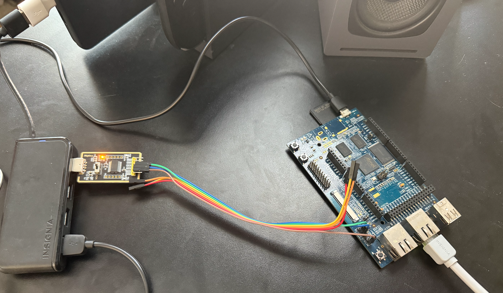
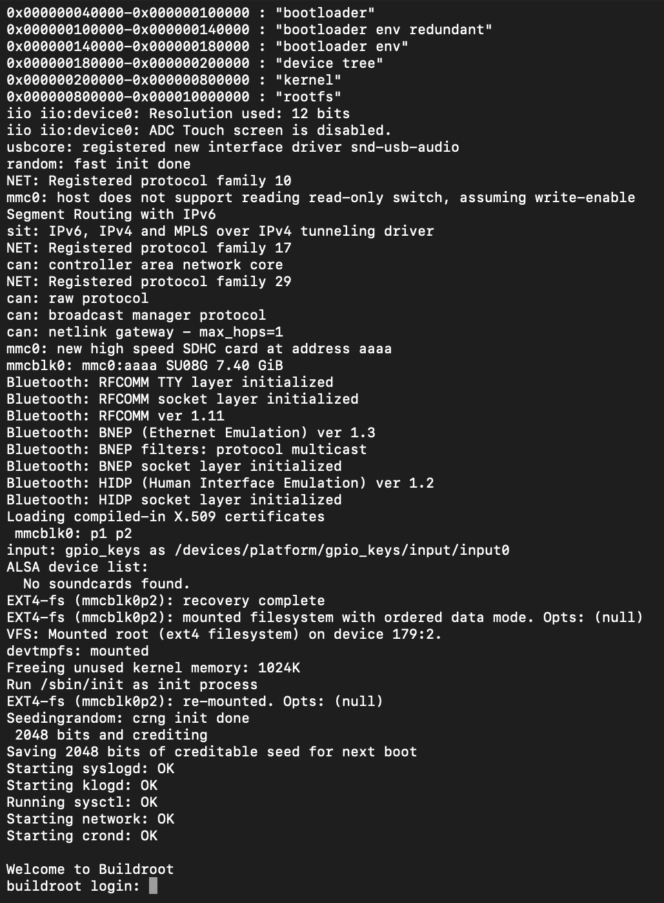
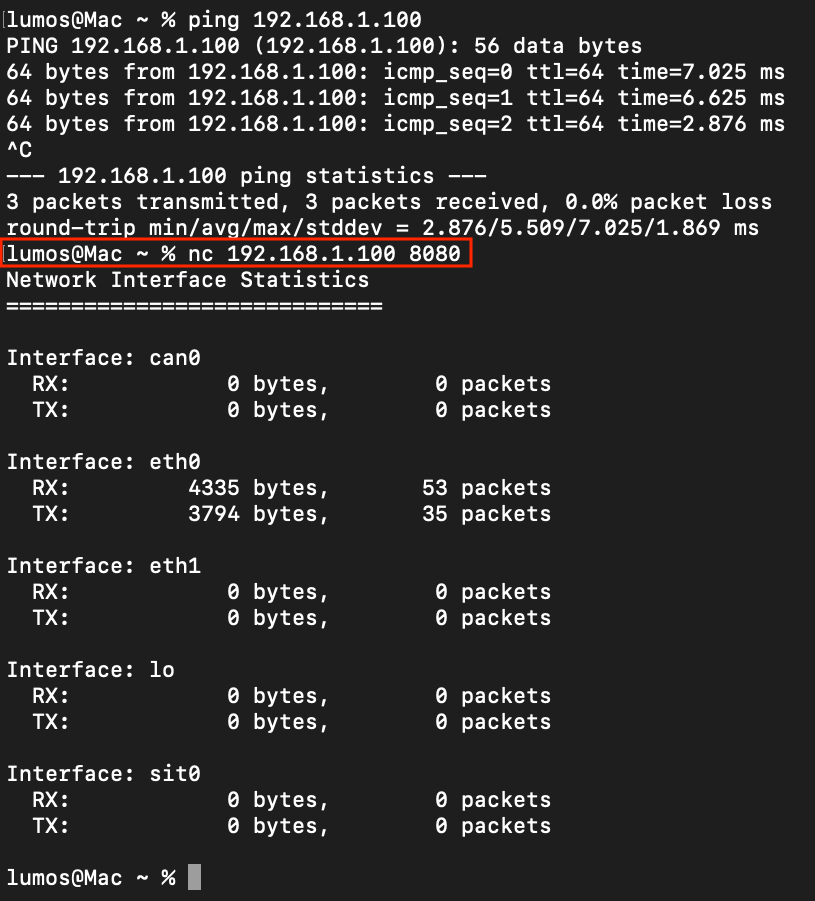

# SAMA5D3 Network Monitor

Embedded Linux network statistics monitor built with Buildroot and C++. Demonstrates real-time `/proc/net/dev` parsing served over TCP sockets on ARM Cortex-A5 hardware.

## 🎯 Project Overview

A lightweight C++ application that:
- Reads network interface statistics from `/proc/net/dev`
- Serves data via TCP socket server on port 8080
- Runs on Atmel SAMA5D3 Xplained board (ARM Cortex-A5)
- Built with Buildroot

## 🛠️ Tech Stack

- **Hardware:** Atmel SAMA5D3 Xplained (ARM Cortex-A5, 256MB RAM)
- **OS:** Embedded Linux (Buildroot, kernel 5.10)
- **Language:** C++14
- **Build System:** CMake, ARM cross-compilation toolchain
- **Bootloader:** AT91Bootstrap + U-Boot
- **Networking:** TCP sockets, DHCP client

## ✨ Features

- Real-time network interface monitoring (RX/TX bytes and packets)
- TCP server on port 8080
- Graceful signal handling (SIGINT/SIGTERM)
- Static linking for minimal dependencies
- Zero runtime dependencies on target

## 🚀 Quick Start

### Connect to the Running Monitor
```bash
# From any machine on the same network
nc <board-ip> 8080

# Output example:
Network Interface Statistics
=============================

Interface: eth0
  RX:         4335 bytes,       53 packets
  TX:         3794 bytes,       35 packets
```

## 📸 Demo


*SAMA5D3 board with serial console and Ethernet connection*


*Linux kernel booting from SD card*


*Network monitor running on the board*


*Connecting from Mac and viewing real-time network statistics*

## 🏗️ Building from Source

See detailed build instructions in:
- [Buildroot Setup](docs/BUILDROOT_SETUP.md)
- [Hardware Setup](docs/HARDWARE_SETUP.md)
- [Deployment Guide](docs/DEPLOYMENT.md)

### Quick Build (if you have Buildroot already)
```bash
cd src
./build.sh
# Binary: build/network_monitor
```

## 📋 Requirements

**Development Environment:**
- Linux host (or Lima VM on macOS)
- Buildroot 2024.x
- CMake 3.10+
- ARM cross-compilation toolchain (provided by Buildroot)

**Target Hardware:**
- Atmel SAMA5D3 Xplained board
- microSD card (4GB+)
- Serial console (UART)
- Ethernet connection

## 🎓 Learning Outcomes

This project demonstrates:
- ✅ Embedded Linux board bring-up with Buildroot
- ✅ Cross-compilation for ARM targets
- ✅ C++ systems programming (sockets, file I/O, signal handling)
- ✅ Linux kernel interfaces (`/proc` filesystem)
- ✅ TCP/IP networking on embedded systems
- ✅ Modern C++ features (lambdas, RAII, std::function)
- ✅ Static linking for embedded deployment

## 🤖 Development Notes

This project was built with AI assistance (Claude) for rapid prototyping and development workflow optimization. All code was reviewed, understood, and tested on real hardware.

## 📝 License

MIT License - see LICENSE file for details

## 🙏 Acknowledgments

- Built with Buildroot
- Atmel/Microchip for SAMA5D3 board support
- AI-assisted development with Anthropic Claude
